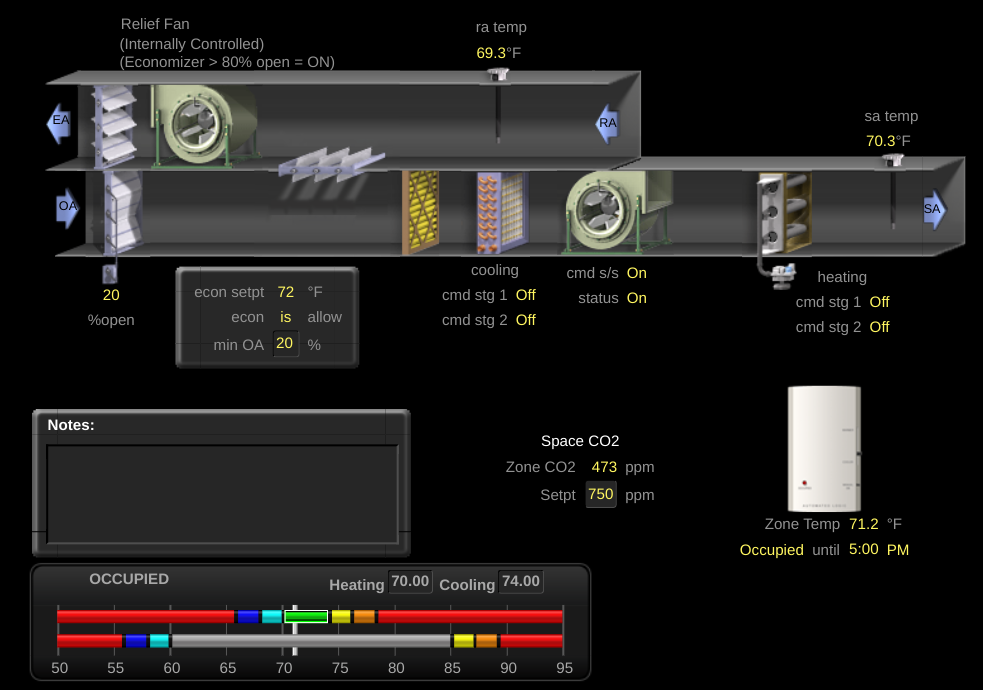
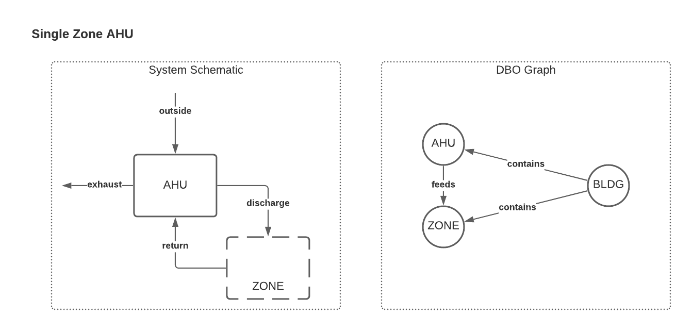
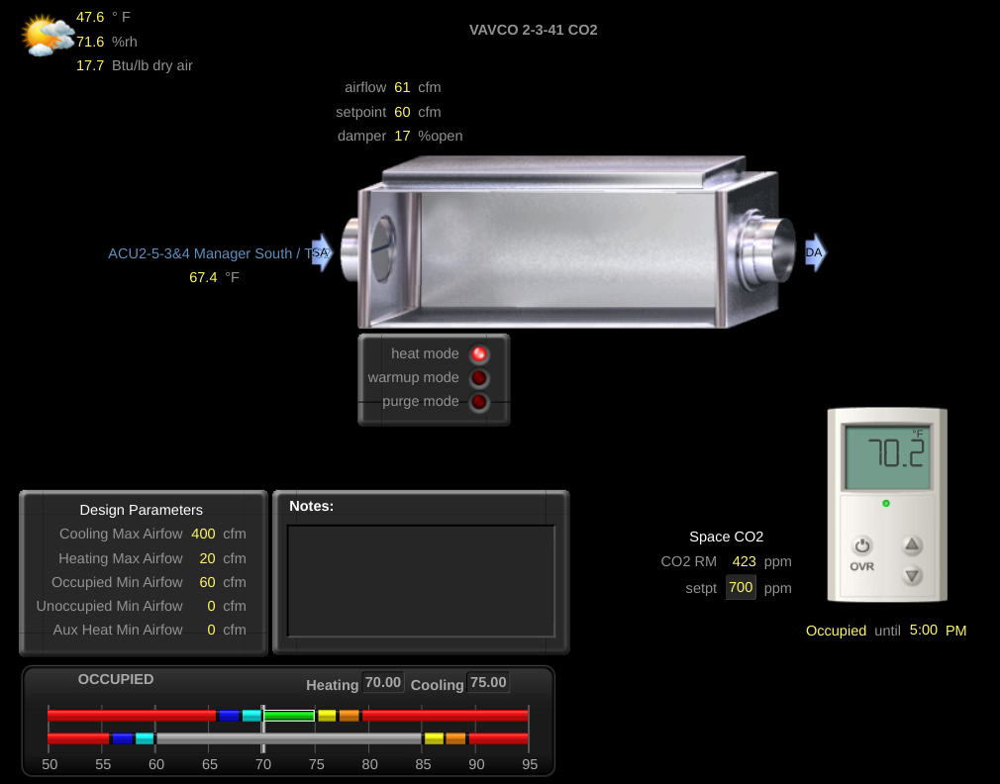
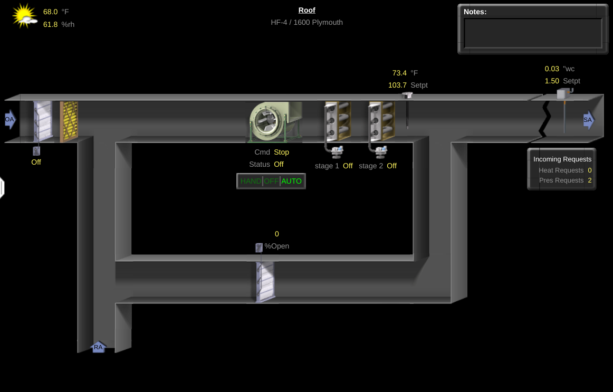
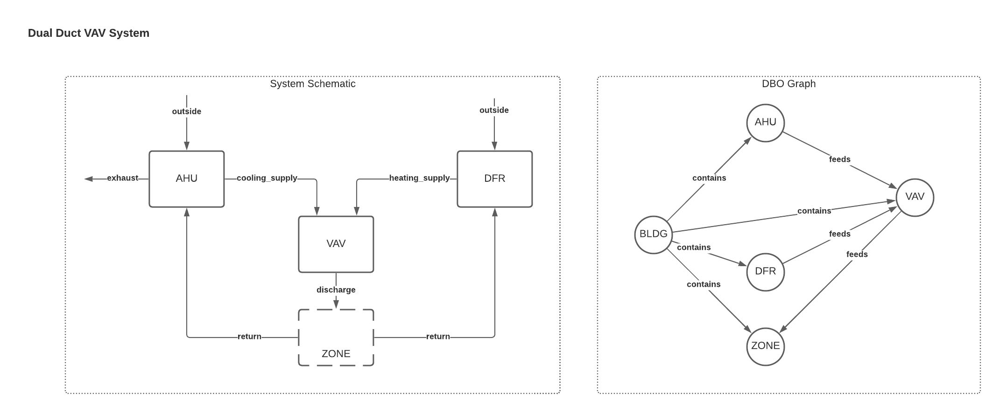

# Air Handling Units (AHU)

## Type Definition
Air handling units are common air-side devices which provide conditioning and ventilation to a space or group of spaces. It must handle outside air directly in order to be considered part of this class. Common terms for AHUs include air conditioning units (AC, ACU, etc.) and rooftop units (RTU); note that the location and other specifics of the device (e.g. using DX cooling instead of chilled water) are not considered relevant to whether a device qualifies as an AHU.

## Type Requirements
- It *must* have a fan.
- It *must* condition the air in some way.
- It *must* handle outside air directly.
- It *must* handle return air from the space.

## Example: Single Zone AHUs 
This version of AHU serves an individual zone as a stand-alone device.

### BMS Example


### System Diagram and Connections


### Sample Building Config
```yaml
BLDG-1:
  type: FACILITIES/BUILDING

ZONE-1:
  connections:
    BLDG-1: CONTAINS
    AHU-1: FEEDS
  type: FACILITIES/ZONE


AHU-1:
  cloud_device_id: 1234
  connections:
    BLDG-1: CONTAINS
  type: HVAC/AHU_DFSS_...
  translation:
    compressor_run_command:
      present_value: points.comp_cmd.present_value
      units:
        key: pointset.points.comp_cmd.units
        values:
          percent: '%'
    discharge_air_temperature_sensor:
      present_value: points.supply_air_temperature_sensor.present_value
      units:
        key: pointset.points.supply_air_temperature_sensor.units
        values:
          degrees_celsius: degC
    ...

```

## Example: Multi-Zone AHUs 
This version of AHU serves a group of zones through downstream terminal units (VAVs).

### BMS Example



### System Diagram and Connections


### Sample Building Config
```yaml
BLDG-1:
  type: FACILITIES/BUILDING

ZONE-1:
  connections:
    BLDG-1: CONTAINS
    VAV-1: FEEDS
  type: FACILITIES/ZONE

AHU-1:
  cloud_device_id: 1234
  connections:
    BLDG-1: CONTAINS
  type: HVAC/AHU_SFSS_SFVSC_...
  translation:
    chilled_water_valve_percentage_command:
      present_value: points.cooling_valve_percentage_command.present_value
      units:
        key: pointset.points.cooling_valve_percentage_command.units
        values:
          percent: '%'
    supply_air_temperature_sensor:
      present_value: points.supply_air_temperature_sensor.present_value
      units:
        key: pointset.points.supply_air_temperature_sensor.units
        values:
          degrees_celsius: degC
    ...

VAV-1:
  cloud_device_id: 2345
  connections:
    AHU-1: FEEDS
    BLDG-1: CONTAINS
  type: HVAC/VAV_SD_DSP_...
  translation:
    supply_air_damper_percentage_command:
      present_value: points.air_valve_percentage_command.present_value
      units:
        key: pointset.points.air_valve_percentage_command.units
        values:
          percent: '%'
    zone_air_temperature_sensor:
      present_value: points.zn_air_temperature_sensor.present_value
      units:
        key: pointset.points.zn_air_temperature_sensor.units
        values:
          degrees_celsius: degC
    ...

```


## Example: AHU As Part Of Dual Duct System 
This version of AHU serves a group of zones through downstream terminal units (VAVs), and those terminal units are also served by duct furnaces (central air-side heating devices which provide heating via a second set of ductwork known commonly as the 'hot deck').

### BMS Example




### System Diagram and Connections


### Sample Building Config
```yaml
BLDG-1:
  type: FACILITIES/BUILDING

ZONE-1:
  connections:
    BLDG-1: CONTAINS
    VAV-1: FEEDS
  type: FACILITIES/ZONE

AHU-1:
  cloud_device_id: 1234
  connections:
    BLDG-1: CONTAINS
  type: HVAC/AHU_SFSS_SFVSC_...
  translation:
    chilled_water_valve_percentage_command:
      present_value: points.cooling_valve_percentage_command.present_value
      units:
        key: pointset.points.cooling_valve_percentage_command.units
        values:
          percent: '%'
    supply_air_temperature_sensor:
      present_value: points.supply_air_temperature_sensor.present_value
      units:
        key: pointset.points.supply_air_temperature_sensor.units
        values:
          degrees_celsius: degC
    ...

DFR-1:
  cloud_device_id: 2345
  connections:
    BLDG-1: CONTAINS
  type: HVAC/DFR_SFSS_...
  translation:
    heating_water_valve_percentage_command:
      present_value: points.htg_valve_percentage_command.present_value
      units:
        key: pointset.points.htg_valve_percentage_command.units
        values:
          percent: '%'
    supply_air_temperature_sensor:
      present_value: points.supply_air_temperature_sensor.present_value
      units:
        key: pointset.points.supply_air_temperature_sensor.units
        values:
          degrees_celsius: degC
    ...

VAV-1:
  cloud_device_id: 3456
  connections:
    BLDG-1: CONTAINS
    AHU-1: FEEDS
    DFR-1: FEEDS
  type: HVAC/VAV_SD_DSP_...
  translation:
    supply_air_damper_percentage_command:
      present_value: points.air_valve_percentage_command.present_value
      units:
        key: pointset.points.air_valve_percentage_command.units
        values:
          percent: '%'
    zone_air_temperature_sensor:
      present_value: points.zn_air_temperature_sensor.present_value
      units:
        key: pointset.points.zn_air_temperature_sensor.units
        values:
          degrees_celsius: degC
    ...

```

## Optional And Future Extensions
This section contains some additional features and extensions that could be added in future.
- While hydronic systems tie equipment together via an explicitly defined entity (the system itself), there is no such concept in the ontology for air-side systems, at least today. This could be added to help describe convoluted systems.
- Risers do exist in the ontology but are utilized only when data exists specifically for that riser (necessitating the entity) or when the system is convoluted enough to justify it. It is best to omit this type of addition, excepting circumstances where it is absolutely necessary.


**Note:** All BMS screenshots taken from Google's WebCTRL instances. WebCTRL is a building automation system owned by Automated Logic.
