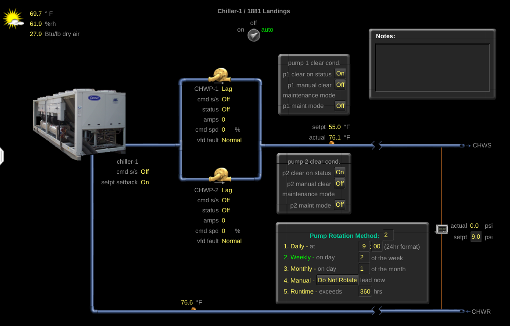
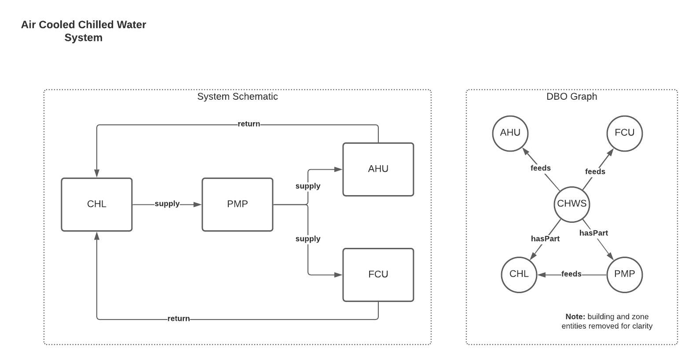
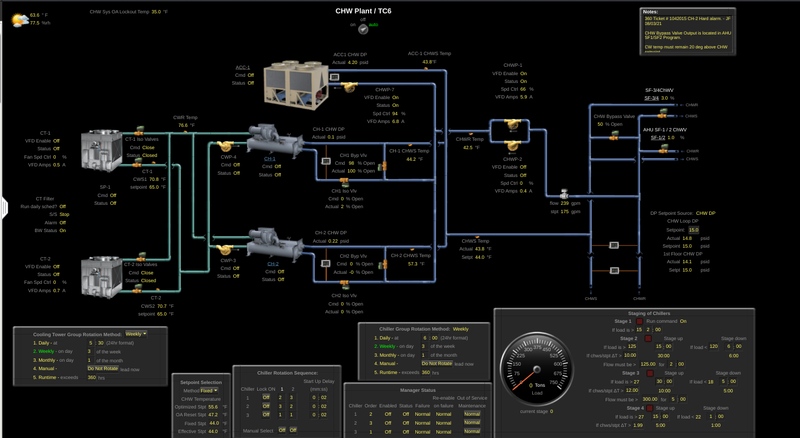
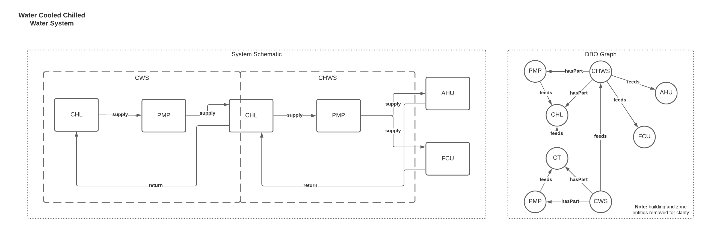

# Chilled & Condensing Water Systems (CHWS & CWS)

## Type Definition
Hydronic cooling and condensing systems. Chilled water systems cool water mechanically, which circulates to end-use devices; they dump the heat absorbed from the chilled water loop either to atmosphere ('air-cooled') or to another water distribution system ('water-cooled'). Condensing systems serve those mechanical devices which rely on water-source heat rejection.

There are many varieties of chilled & condenser water system, but some common examples include:
- **Constant volume** (predominantly on condensing water systems), where pumps run at constant speeds providing fixed flowrates at given stages.
- **Variable primary**, where there is one loop between the chillers and the end devices. The pumps operate at variable speed.
- **Primary/Secondary**, where there are two separate loops, with the primary serving as the production loop and the secondary serving as the distribution loop.

## Type Requirements
- Chillers require the mechanical cooling of water.
- Condensers require that, regardless of their own cooling method (sensible or evaporative), they serve downstream devices which require water as a condensing source.
- Heat exchangers provide heat transfer between two fluid streams, without intermixing the fluids. They are modeled separately only if they are stand-alone devices. 

## Example: Variable Primary CHWS (Air-Cooled) 
This version of CHWS has a single set of variable speed pumps which serve air-cooled chillers and downstream equipment.

### BMS Example

**Notes:**
- The fields associated with individual devices (individual chiller commands, for example) get mapped to those devices; system level telemetry gets assigned to the system directly.

### System Diagram and Connections


### Sample Building Config
```yaml
BLDG-1:
  type: FACILITIES/BUILDING

ZONE-1:
  connections:
    BLDG-1: CONTAINS
  type: FACILITIES/ZONE

ZONE-2:
  connections:
    BLDG-1: CONTAINS
  type: FACILITIES/ZONE

CHWSYS-BLDG-1:
  connections:
    BLDG-1: CONTAINS
    FCU-1: FEEDS
    AHU-1: FEEDS
  type: HVAC/HWS_...
  translation:
    supply_water_temperature_sensor:
      present_value: points.sys_swt.present_value
      units:
        key: pointset.points.sys_swt.units
        values:
          degrees_fahrenheit: 'deg-F'
    differential_pressure_sensor:
      present_value: points.sys_dp.present_value
      units:
        key: pointset.points.sys_dp.units
        values:
          pascals: 'Pa'
    ...

CHL-1:
  connections:
    BLDG-1: CONTAINS
    CHWSYS-BLDG-1: CONTAINS
  type: HVAC/CHL_...
  translation:
    supply_water_temperature_sensor:
      present_value: points.swt.present_value
      units:
        key: pointset.points.swt.units
        values:
          degrees_fahrenheit: 'deg-F'
    ...

PMP-1:
  connections:
    BLDG-1: CONTAINS
    CHWSYS-BLDG-1: CONTAINS
    CHL-1: FEEDS
  type: HVAC/PMP_...
  translation:
    run_command:
      present_value: points.cmd.present_value
      states:
        OFF: 'false'
        ON: 'true'
    ...

PMP-2:
  connections:
    BLDG-1: CONTAINS
    CHWSYS-BLDG-1: CONTAINS
    CHL-1: FEEDS
  type: HVAC/PMP_...
  translation:
    run_command:
      present_value: points.cmd.present_value
      states:
        OFF: 'false'
        ON: 'true'
    ...

FCU-1:
  connections:
    ZONE-1: FEEDS
    BLDG-1: CONTAINS
  type: HVAC/FCU_DFSS_DFVSC_...
  translation:
    chilled_water_valve_percentage_command:
      present_value: points.clg_valve_percentage_command.present_value
      units:
        key: pointset.points.clg_valve_percentage_command.units
        values:
          percent: '%'
    ...

AHU-1:
  connections:
    ZONE-2: FEEDS
    BLDG-1: CONTAINS
  type: HVAC/AHU_DFSS_...
  translation:
    chilled_water_valve_percentage_command:
      present_value: points.chwv.present_value
      units:
        key: pointset.points.chwv.units
        values:
          percent: '%'
    ...


```

## Example: Variable Primary CHWS (Water-Cooled) 
This version of CHWS has a single set of variable speed chilled water pumps serving water-cooled chillers and downstream equipment. The condensing side serves the chillers via two pumps.

### BMS Example

**Notes:**
- This example includes a parallel air-cooled chiller. It is simple enough to add; it doesnt change the way the rest of the system is modeled.

### System Diagram and Connections


### Sample Building Config
```yaml
CHWSYS-BLDG-1:
  connections:
    CDWSYS-BLDG-1: FEEDS
  type: HVAC/HWS_...
  translation:
    supply_water_temperature_sensor:
      present_value: points.sys_swt.present_value
      units:
        key: pointset.points.sys_swt.units
        values:
          degrees_fahrenheit: 'deg-F'
    differential_pressure_sensor:
      present_value: points.sys_dp.present_value
      units:
        key: pointset.points.sys_dp.units
        values:
          pascals: 'Pa'
    ...

CDWSYS-BLDG-1:
  connections:
    ...
  type: HVAC/CDWS_...
  translation:
    supply_water_temperature_sensor:
      present_value: points.sys_swt.present_value
      units:
        key: pointset.points.sys_swt.units
        values:
          degrees_fahrenheit: 'deg-F'
    ...

CT-1:
  connections:
    CHWSYS-BLDG-1: CONTAINS
  type: HVAC/CT_...
  translation:
    supply_water_temperature_sensor:
      present_value: points.swt.present_value
      units:
        key: pointset.points.swt.units
        values:
          degrees_fahrenheit: 'deg-F'
    ...

CT-2:
  connections:
    CHWSYS-BLDG-1: CONTAINS
  type: HVAC/CT_...
  translation:
    supply_water_temperature_sensor:
      present_value: points.swt.present_value
      units:
        key: pointset.points.swt.units
        values:
          degrees_fahrenheit: 'deg-F'
    ...

CH-1:
  connections:
    CHWSYS-BLDG-1: CONTAINS
  type: HVAC/CHL_...
  translation:
    supply_water_temperature_sensor:
      present_value: points.swt.present_value
      units:
        key: pointset.points.swt.units
        values:
          degrees_fahrenheit: 'deg-F'
    ...

CH-2:
  connections:
    CHWSYS-BLDG-1: CONTAINS
  type: HVAC/CHL_...
  translation:
    supply_water_temperature_sensor:
      present_value: points.swt.present_value
      units:
        key: pointset.points.swt.units
        values:
          degrees_fahrenheit: 'deg-F'
    ...

ACC-1:
  connections:
    CHWSYS-BLDG-1: CONTAINS
  type: HVAC/CHL_...
  translation:
    supply_water_temperature_sensor:
      present_value: points.swt.present_value
      units:
        key: pointset.points.swt.units
        values:
          degrees_fahrenheit: 'deg-F'
    ...

CHWP-1:
  connections:
    BLDG-1: CONTAINS
    CHWSYS-BLDG-1: CONTAINS
    CHL-1: FEEDS
  type: HVAC/PMP_...
  translation:
    run_command:
      present_value: points.cmd.present_value
      states:
        OFF: 'false'
        ON: 'true'
    ...

CHWP-2:
  connections:
    BLDG-1: CONTAINS
    CHWSYS-BLDG-1: CONTAINS
    CHL-1: FEEDS
  type: HVAC/PMP_...
  translation:
    run_command:
      present_value: points.cmd.present_value
      states:
        OFF: 'false'
        ON: 'true'
    ...

CWP-4:
  connections:
    BLDG-1: CONTAINS
    CDWSYS-BLDG-1: CONTAINS
    CHL-1: FEEDS
  type: HVAC/PMP_...
  translation:
    run_command:
      present_value: points.cmd.present_value
      states:
        OFF: 'false'
        ON: 'true'
    ...

CWP-4:
  connections:
    BLDG-1: CONTAINS
    CDWSYS-BLDG-1: CONTAINS
    CHL-1: FEEDS
  type: HVAC/PMP_...
  translation:
    run_command:
      present_value: points.cmd.present_value
      states:
        OFF: 'false'
        ON: 'true'
    ...

FCU-1:
  connections:
    CHWSYS-BLDG-1: FEEDS
  type: HVAC/FCU_DFSS_DFVSC_...
  translation:
    chilled_water_valve_percentage_command:
      present_value: points.clg_valve_percentage_command.present_value
      units:
        key: pointset.points.clg_valve_percentage_command.units
        values:
          percent: '%'
    ...

AHU-1:
  connections:
    CHWSYS-BLDG-1: FEEDS
  type: HVAC/AHU_DFSS_...
  translation:
    chilled_water_valve_percentage_command:
      present_value: points.chwv.present_value
      units:
        key: pointset.points.chwv.units
        values:
          percent: '%'
    ...


```