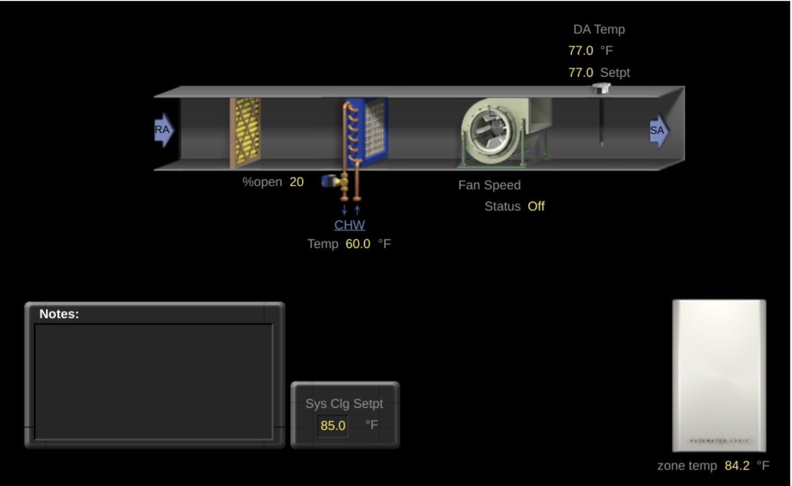
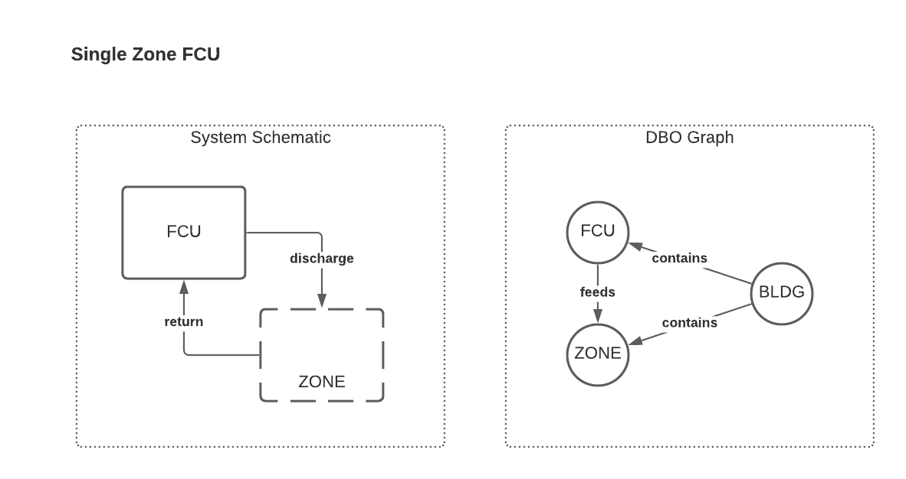
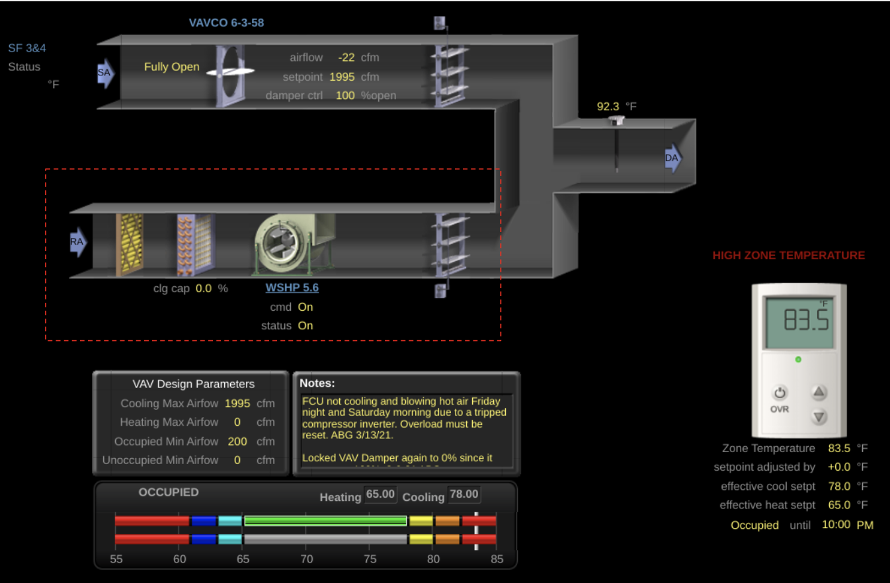
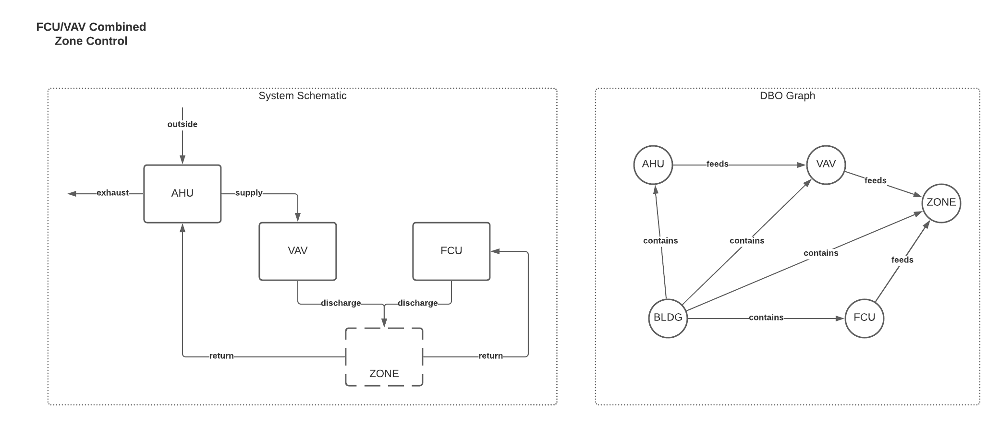
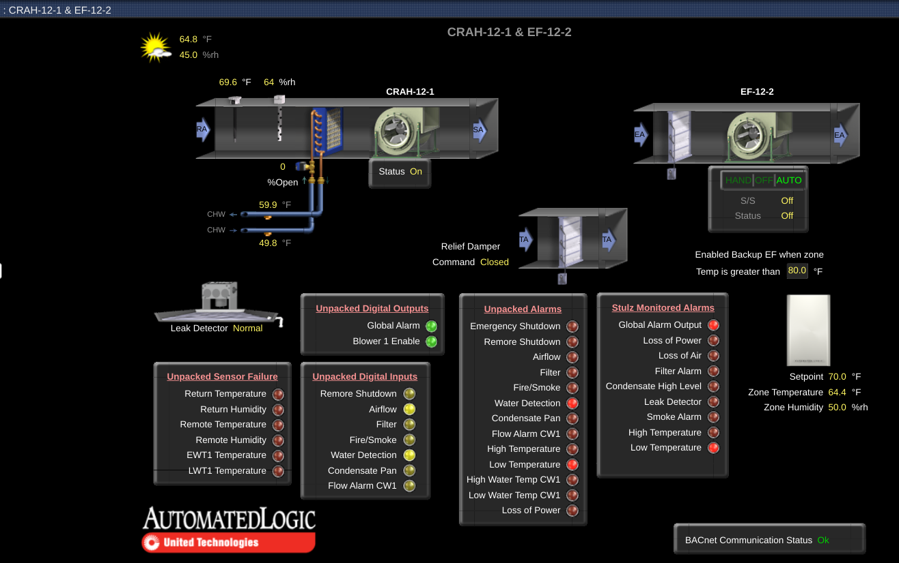
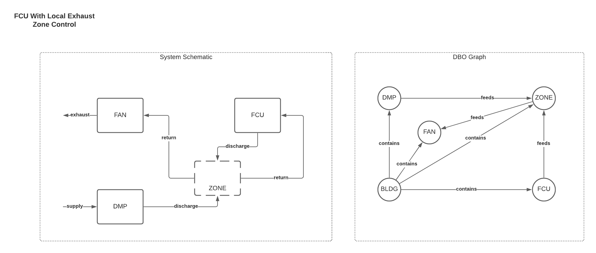

# Fan Coil Units (FCU)

## Type Definition
Fan coil units are air-side devices which provides conditioning to a space. It must be recirculation only (i.e. no integral fresh air capabilities) in order to be considered part of this class. Note that there is no consideration made for space type (e.g. a CRAC unit that serves a server room would be considered a FCU if it is configured based on the type requirements; there is no special designation for zone, and so if this is wanted the unit should be connected to a zone with the appropriate space type designation). There is also no differentiation between a heat pump and a FCU (excepting a heat pump which utilizes outside air directly, or breaks one of the other rules listed below).

## Type Requirements
- It *must* have a fan.
- It *must* condition the air in some way.
- It *must not* handle outside air directly.
- It *must* handle return air from the space.

## Example: Stand-Alone FCUs 
This version of FCU serves an individual zone as a stand-alone device.

### BMS Example


### System Diagram and Connections


### Sample Building Config
```yaml
BLDG-1:
  type: FACILITIES/BUILDING

ZONE-1:
  connections:
    FCU-1: FEEDS
    BLDG-1: CONTAINS
  type: FACILITIES/ZONE

FCU-1:
  connections:
    BLDG-1: CONTAINS
    # Note: the chilled water system would also be linked here, if the unit is fed from it.
  type: HVAC/FCU_DFSS_DFVSC_ZTC_CHWZTC_FDPM_RMM
  translation:
    chilled_water_valve_percentage_command:
      present_value: points.cooling_valve_percentage_command.present_value
      units:
        key: pointset.points.cooling_valve_percentage_command.units
        values:
          percent: '%'
    discharge_air_temperature_sensor:
      present_value: points.supply_air_temperature_sensor.present_value
      units:
        key: pointset.points.supply_air_temperature_sensor.units
        values:
          degrees_celsius: degC
    ...

```


## Example: FCU & VAV Tandem Zone
This version of FCU serves an individual zone in cooperation with another system (e.g. an IDF room with lead/standby or lead/lag control scheme, perhaps as day-time VAV and night-time FCU).

### BMS Example

**Notes:**
- The fact that this FCU uses water-source condensing is irrelevant to its classification as a FCU.
- The VAV and FCU will share the same zone temperature sensor and cooling setpoint.
- If there is a single reporting device for this system (i.e. the FCU and VAV are on the same BACnet device) then the model will require virtual types: one for the FCU, and one for the VAV. As noted above, two virtual devices can have common telemetry (e.g. zone temperature sensor and setpoint).

### System Diagram and Connections

### Sample Building Config

```yaml
BLDG-1:
  type: FACILITIES/BUILDING

ZONE-1:
  connections:
    BLDG-1: CONTAINS
    FCU-1: FEEDS
  type: FACILITIES/ZONE

FCU-1:
  connections:
    # Note: the chilled water system would also be linked here, if the unit is fed from it.
    BLDG-1: CONTAINS
  type: HVAC/FCU_DFSS_DFVSC_...
  translation:
    chilled_water_valve_percentage_command:
      present_value: points.cooling_valve_percentage_command.present_value
      units:
        key: pointset.points.cooling_valve_percentage_command.units
        values:
          percent: '%'
    discharge_air_temperature_sensor:
      present_value: points.supply_air_temperature_sensor.present_value
      units:
        key: pointset.points.supply_air_temperature_sensor.units
        values:
          degrees_celsius: degC
    zone_air_temperature_sensor:
      present_value: points.zn_air_temperature_sensor.present_value
      units:
        key: pointset.points.zn_air_temperature_sensor.units
        values:
          degrees_celsius: degC
    ...

AHU-1:
  connections:
    BLDG-1: CONTAINS
  type: HVAC/AHU_SFSS_SFVSC_...
  translation:
    chilled_water_valve_percentage_command:
      present_value: points.cooling_valve_percentage_command.present_value
      units:
        key: pointset.points.cooling_valve_percentage_command.units
        values:
          percent: '%'
    supply_air_temperature_sensor:
      present_value: points.supply_air_temperature_sensor.present_value
      units:
        key: pointset.points.supply_air_temperature_sensor.units
        values:
          degrees_celsius: degC
    ...

VAV-1:
  connections:
    AHU-1: FEEDS
    BLDG-1: CONTAINS
  type: HVAC/VAV_SD_DSP_...
  translation:
    supply_air_damper_percentage_command:
      present_value: points.air_valve_percentage_command.present_value
      units:
        key: pointset.points.air_valve_percentage_command.units
        values:
          percent: '%'
    zone_air_temperature_sensor:
      present_value: points.zn_air_temperature_sensor.present_value
      units:
        key: pointset.points.zn_air_temperature_sensor.units
        values:
          degrees_celsius: degC
    ...


```


## Example: FCU With Local Exhaust Control
This version of FCU serves an individual zone; the zone is independently temperature controlled by an exhaust fan and transfer damper, which facilitates additional air flow through the zone when cooling load exceeds FCU capacity.

### BMS Example

**Notes:**
- The exhaust fan and damper operate in coordination, but the damper is an independent device; therefore it msut be modeled separately.
- This system uses the fan to pull additional cooling air from adjacent zones for additional high-load control; this is somewhat uncommon, but the model would look identical even if the fan was controlling to pressure rather than temperature (the only differences being the fields available and mapped to each device).

### System Diagram and Connections

### Sample Building Config

```yaml
BLDG-1:
  type: FACILITIES/BUILDING

ZONE-1:
  connections:
    BLDG-1: CONTAINS
    FCU-1: FEEDS
  type: FACILITIES/ZONE

FCU-1:
  connections:
    BLDG-1: CONTAINS
  type: HVAC/FCU_DFSS_DFVSC_...
  translation:
    chilled_water_valve_percentage_command:
      present_value: points.cooling_valve_percentage_command.present_value
      units:
        key: pointset.points.cooling_valve_percentage_command.units
        values:
          percent: '%'
    discharge_air_temperature_sensor:
      present_value: points.supply_air_temperature_sensor.present_value
      units:
        key: pointset.points.supply_air_temperature_sensor.units
        values:
          degrees_celsius: degC
    zone_air_temperature_sensor:
      present_value: points.zn_air_temperature_sensor.present_value
      units:
        key: pointset.points.zn_air_temperature_sensor.units
        values:
          degrees_celsius: degC
    ...

EF-1:
  connections:
    BLDG-1: CONTAINS
    ZONE-1: FEEDS
  type: HVAC/FAN_SS_CSP...
  translation:
    run_command:
      present_value: points.cmd.present_value
      units:
        key: pointset.points.cmd.units
        states:
          ON: on
          OFF: off
    zone_air_temperature_sensor:
      present_value: points.zn_air_temperature_sensor.present_value
      units:
        key: pointset.points.zn_air_temperature_sensor.units
        values:
          degrees_celsius: degC
    ...

DMP-1:
  connections:
    ZONE-1: FEEDS
    BLDG-1: CONTAINS
  type: HVAC/DMP_...
  translation:
    supply_air_damper_command:
      present_value: points.air_valve_command.present_value
      units:
        key: pointset.points.air_valve_command.units
        values:
          percent: '%'
    zone_air_temperature_sensor:
      present_value: points.zn_air_temperature_sensor.present_value
      units:
        key: pointset.points.zn_air_temperature_sensor.units
        values:
          degrees_celsius: degC
    ...


```

**Note:** All BMS screenshots taken from Google's WebCTRL instances. WebCTRL is a building automation system owned by Automated Logic.


