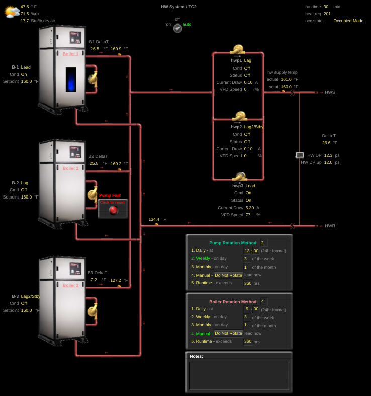
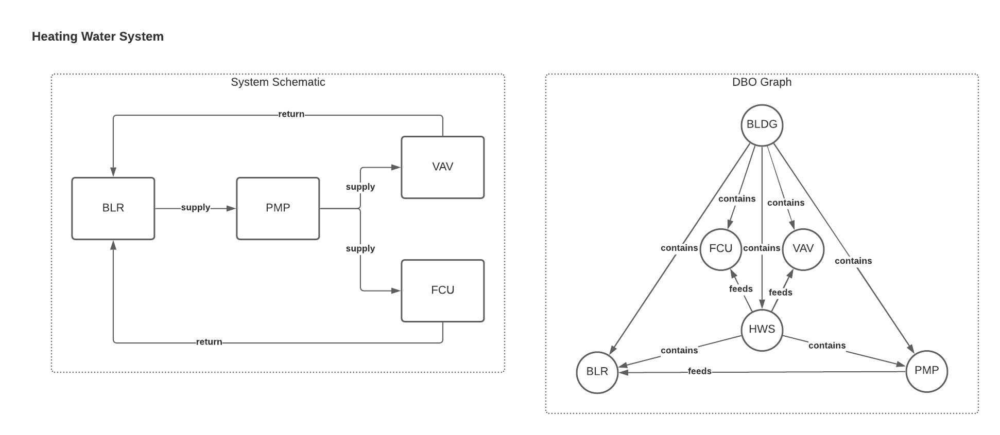

# Heating Water Systems (HWS)

## Type Definition
Hydronic heating systems (HWS) contain boilers (BLR), pumps (PMP), and associated field telemetry.

## Type Requirements
- It *must* handle water for the purposes of heating.

## Example: Variable Primary HWS 
This version of HWS has a single set of variable speed pumps which serve boilers and downstream equipment.

### BMS Example

**Notes:**
- The fields associated with individual devices (individual supply water temps for each boiler, for example) get mapped to those devices; system level telemetry gets assigned to the system directly.

### System Diagram and Connections


### Sample Building Config
```yaml
BLDG-1:
  type: FACILITIES/BUILDING

ZONE-1:
  connections:
    BLDG-1: CONTAINS
    VAV-1: FEEDS
  type: FACILITIES/ZONE

ZONE-2:
  connections:
    BLDG-1: CONTAINS
    FCU-1: FEEDS
  type: FACILITIES/ZONE

# Define the system that all equipment is part of.
# It will feed all downstream equipment.
HWSYS-BLDG-1:
  cloud_device_id: 1234
  connections:
    BLDG-1: CONTAINS
  type: HVAC/HWS_...
  translation:
    supply_water_temperature_sensor:
      present_value: points.sys_swt.present_value
      units:
        key: pointset.points.sys_swt.units
        values:
          degrees_fahrenheit: 'deg-F'
    differential_pressure_sensor:
      present_value: points.sys_dp.present_value
      units:
        key: pointset.points.sys_dp.units
        values:
          pascals: 'Pa'
    ...


# Define the equipment for the system and connect it to the system
# Additional intrasystem connections can be made as well.
BLR-1:
  cloud_device_id: 12234
  connections:
    BLDG-1: CONTAINS
    HWSYS-BLDG-1: HAS_PART
    PMP-1: FEEDS
    PMP-2: FEEDS
    PMP-3: FEEDS
  type: HVAC/BLR_...
  translation:
    supply_water_temperature_sensor:
      present_value: points.swt.present_value
      units:
        key: pointset.points.swt.units
        values:
          degrees_fahrenheit: 'deg-F'
    ...

BLR-2:
  cloud_device_id: 12334
  connections:
    BLDG-1: CONTAINS
    HWSYS-BLDG-1: HAS_PART
    PMP-1: FEEDS
    PMP-2: FEEDS
    PMP-3: FEEDS
  type: HVAC/BLR_...
  translation:
    supply_water_temperature_sensor:
      present_value: points.swt.present_value
      units:
        key: pointset.points.swt.units
        values:
          degrees_fahrenheit: 'deg-F'
    ...

BLR-3:
  cloud_device_id: 12344
  connections:
    BLDG-1: CONTAINS
    HWSYS-BLDG-1: HAS_PART
    PMP-1: FEEDS
    PMP-2: FEEDS
    PMP-3: FEEDS
  type: HVAC/BLR_...
  translation:
    supply_water_temperature_sensor:
      present_value: points.swt.present_value
      units:
        key: pointset.points.swt.units
        values:
          degrees_fahrenheit: 'deg-F'
    ...

PMP-1:
  cloud_device_id: 12345
  connections:
    BLDG-1: CONTAINS
    HWSYS-BLDG-1: CONTAINS
  type: HVAC/PMP_...
  translation:
    run_command:
      present_value: points.cmd.present_value
      states:
        OFF: 'false'
        ON: 'true'
    ...

PMP-2:
  cloud_device_id: 123432
  connections:
    BLDG-1: CONTAINS
    HWSYS-BLDG-1: CONTAINS
  type: HVAC/PMP_...
  translation:
    run_command:
      present_value: points.cmd.present_value
      states:
        OFF: 'false'
        ON: 'true'
    ...

PMP-3:
  cloud_device_id: 123443
  connections:
    BLDG-1: CONTAINS
    HWSYS-BLDG-1: CONTAINS
  type: HVAC/PMP_...
  translation:
    run_command:
      present_value: points.cmd.present_value
      states:
        OFF: 'false'
        ON: 'true'
    ...


# Define the equipment which is fed from the system, and connect it to the systems.
FCU-1:
  cloud_device_id: 123453
  connections:
    BLDG-1: CONTAINS
    HWSYS-BLDG-1: FEEDS
  type: HVAC/FCU_DFSS_DFVSC_...
  translation:
    heating_water_valve_percentage_command:
      present_value: points.htg_valve_percentage_command.present_value
      units:
        key: pointset.points.htg_valve_percentage_command.units
        values:
          percent: '%'
    ...

VAV-1:
  cloud_device_id: 12346526
  connections:
    BLDG-1: CONTAINS
    HWSYS-BLDG-1: FEEDS
  type: HVAC/VAV_SD_DSP_...
  translation:
    heating_water_valve_percentage_command:
      present_value: points.hwv.present_value
      units:
        key: pointset.points.hwv.units
        values:
          percent: '%'
    ...


```

**Note:** All BMS screenshots taken from Google's WebCTRL instances. WebCTRL is a building automation system owned by Automated Logic.