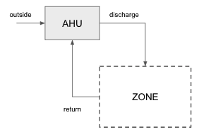
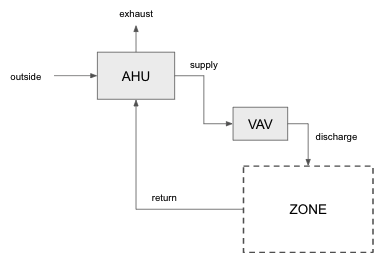
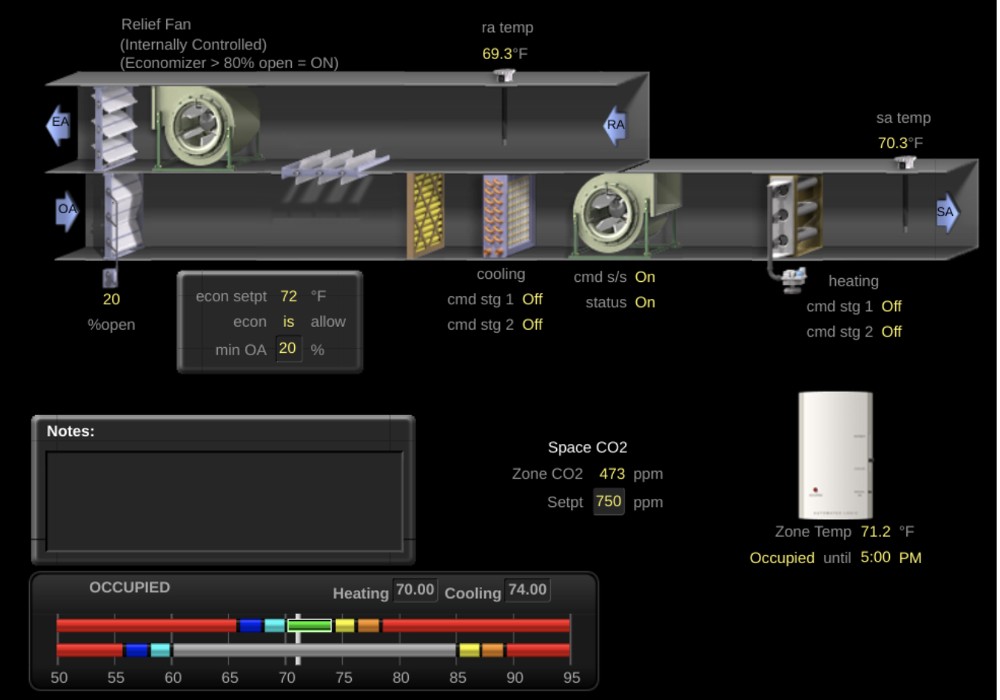
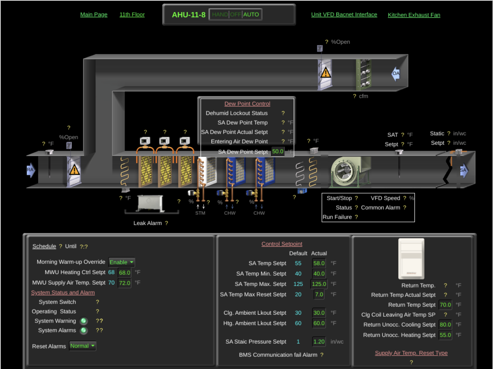
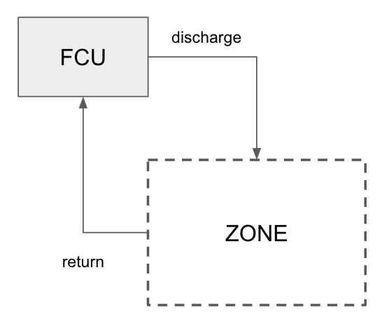

# Modeling Systems and Equipment

This project aims to provide strong guidance in modeling; this is to ensure that all models retain certain commonalities, even while being constructed by disparate modelers with different system contexts. This document is intended to outline some common system types and how they may be modeled effectively and consistently.

## Modeling Domains

### Air Handlers (AHU)

#### Type Definition
Air-handlers are air-side devices that provides air to a zone directly or indirectly via terminal units, providing recirculated, fresh air, or some mixture of both. They can range from small rooftop units to large penthouse constructions; size is not relevant to this class designation.

#### Type Requirements
- It *must* have a fan.
- It *must* condition the air in some way.
- It *must* handle outside air directly (not simply fed by some upstream device).
- It *must* handle return air from the space.

#### System Diagram
- **Single zone AHUs:** Serve individual spaces directly; there are no modulating terminals.

- **Multi-zone AHUs** Serve multiple zones via terminals.

#### BMS Examples

Here are some example BMS screenshots for the systems listed above.

### Fan Coil Units (FCU)

#### Type Definition
Fan coil units are air-side devices which provides conditioning to a space. It must be recirculation only (i.e. no integral fresh air capabilities) in order to be considered part of this class. Note that there is no consideration made for space type (e.g. a CRAC unit that serves a server room would be considered a FCU if it is configured based on the type requirements; there is no special designation for zone, and so if this is wanted the unit should be connected to a zone with the appropriate space type designation). There is also no differentiation between a heat pump and a FCU (excepting a heat pump which utilizes outside air directly, or breaks one of the other rules listed below).

#### Type Requirements
- It *must* have a fan.
- It *must* condition the air in some way.
- It *must not* handle outside air directly.
- It *must* handle return air from the space.

#### System Diagram

- **Stand-Alone FCUs:** serve individual zones as stand-alone devices.

- **FCUs As Part Of A System:** serve individual zones but in cooperation with another system (e.g. an IDF room with lead/standby or lead/lag control scheme, perhaps as day-time VAV and night-time FCU).

#### BMS Examples

Here are example BMS screenshots for the systems listed above.

Notes:
- The fact that this FCU uses water-source condensing is irrelevant to its classification as a FCU.
- The VAV and FCU will share the same zone temperature sensor and cooling setpoint.
- If there is a single reporting device for this system (i.e. the FCU and VAV are on the same BACnet device) then the model will require virtual types: one for the FCU, and one for the VAV. As noted above, two virtual devices can have common telemetry (e.g. zone temperature sensor and setpoint).
