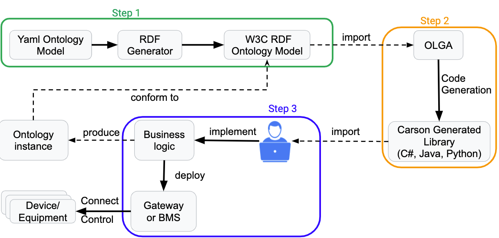
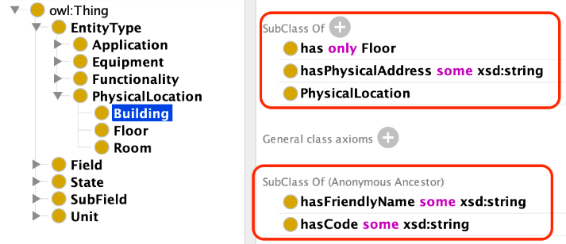
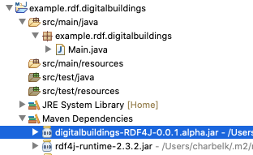
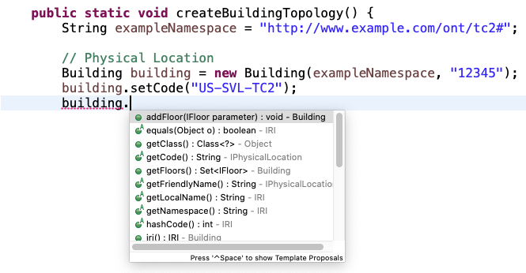
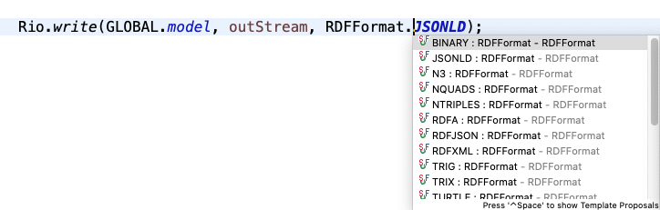

# Ontology RDF Usage Example

This example steps, depicted in the figure below, consists of the following:



  * [Prerequisites](#prerequisites)
  * [1. The RDF Ontology](#1-the-rdf-ontology)
  * [2. Code Generation with OLGA](#2-code-generation-with-olga)
    + [OLGA](#olga)
    + [Generated Code](#generated-code)
    + [Compile the Generated code](#compile-the-generated-code)
    + [The Generated Code Overview](#the-generated-code-overview)
  * [3. Instantiate the Ontology Model with the Generated Code](#3-instantiate-the-ontology-model-with-the-generated-code)
    + [Import the Generated Library](#import-the-generated-library)
    + [Implementing the Business Logic](#implementing-the-business-logic)
  * [4. Serialize the Ontology Instance](#4-serialize-the-ontology-instance)
  * [5. Telemetry](#5-telemetry)
  * [6. Graph RDF Store](#6-graph-rdf-store)


## Prerequisites

For this example you will need the following:
1. A _Java Virtual Machine_ (version > 1.8) 
[download JVM 1.8](http://www.oracle.com/technetwork/java/javase/downloads/jre8-downloads-2133155.html).
2. _Protégé_ is an open source ontology editor provided by Stanford University.
 [download Protégé](http://protege.stanford.edu/products.php#desktop-protege).
3. _Apache Maven_ a software project management 
[download Maven](https://maven.apache.org/download.cgi).

## 1. The RDF Ontology

The Digital Buildings repo proposes two formats: [yaml](https://github.com/google/digitalbuildings/blob/master/ontology/yaml/README.md), and [rdf/owl](https://github.com/google/digitalbuildings/blob/master/ontology/rdf/README.md).

Use the [RDF Generator](https://github.com/google/digitalbuildings/blob/master/tools/rdf_generator/README.md) to generate an RDF Format, similar to the one on the [repo](https://github.com/google/digitalbuildings/tree/master/ontology/rdf/README.md).

In this example, we rely on [Protege](https://protege.stanford.edu/) to visualize it.

## 2. Code Generation with OLGA
In this step 2, we will generate code from the RDF model by relying on 
[OLGA](https://ecostruxure.github.io/OLGA/).

### OLGA
Ontology Library GenerAtor (OLGA) is an open source project which takes as
 input a W3C standard ontology and generates code in one or several languages 
 such as (C#, Java, and Python).
 
 The generated code is dependent on one of the many available libraries such as 
 [RDF4J](https://rdf4j.org/), [OWL API](https://github.com/owlcs/owlapi), 
 [Trinity RDF](https://trinity-rdf.net/), and many others.

This generated code will allow a developer to easily create an instance of a 
building model in RDF without any pre-requisite knowledge of the W3C standards. 
The developer will instantiate classes and link them together to create an 
instance of a building topology with its floors, rooms, HVAC equipment, meters, 
and how they are related to each other.

### Generated Code

In this example, we already generated the code for you using 
[OLGA](https://ecostruxure.github.io/OLGA/).

There is a minor bug with OLGA where the code generation fails, a bug has been created [bug-17](https://github.com/EcoStruxure/OLGA/issues/17)

An example of a generated source code can be found [here](https://github.com/charbull/OLGA-GeneratedCode-DigitalBuildingsOntology/blob/master/README.md).
It is in Java and relies on the [RDF4J](https://rdf4j.org/) existing library. This code is not expected to be in sync.


### Compile the Generated code
 
Run the following command using `Apache Maven` to generate a .jar: 
 ```shell script
cd digitalbuildings-RDF4J-java
mvn clean install
```
OLGA takes the `digital buildings` RDF format ontology and generates `2667` Java classes.

Explore the generated code to see all generated components from the ontology.

### The Generated Code Overview

The following Java code snippet shows part of the code generated by OLGA for 
the class `PhysicalLocation` is a subclass of `EntityType` as shown in the figure below.



```java
public class PhysicalLocation extends EntityType implements IPhysicalLocation{

 IRI newInstance;

 public PhysicalLocation(String namespace, String instanceId) {
  super(namespace, instanceId);

  newInstance = GLOBAL.factory.createIRI(namespace, instanceId);
  GLOBAL.model.add(this, RDF.TYPE, GLOBAL.factory
        .createIRI("http://www.google.com/digitalbuildings/0.0.1/f" 
        + "acilities#PhysicalLocation"));
 }

 public IRI iri() {
  return newInstance;
 }

        
 public void setFriendlyName(String param) {
         GLOBAL.model.add(this,  GLOBAL.factory.createIRI("http://www.google.com" 
         + "/digitalbuildings/0.0.1#hasFriendlyName"), 
         GLOBAL.factory.createLiteral(param));
 }
       
 public void setCode(String param) {
         GLOBAL.model.add(this, GLOBAL.factory
          .createIRI("http://www.google.com/digitalbuildings/0.0.1#hasCode"),  
              GLOBAL.factory.createLiteral(param));
}}
```      

The generated code is dependent on the underlying library RDF4J which is an 
open source project.
The following code snippet, shows the generated code in Java for the Building 
`owl:Class` which is a subclass of `PhysicalLocation`.

```java
/**
* Class Building 
* This is a type for BUILDING facilities object
*/
@SuppressWarnings("serial")
public class Building extends PhysicalLocation implements IBuilding{

     IRI newInstance;
     public Building(String namespace, String instanceId) {
                super(namespace, instanceId);

                newInstance = GLOBAL.factory.createIRI(namespace, instanceId);
                GLOBAL.model.add(this, RDF.TYPE, GLOBAL.factory.createIRI(
"http://www.google.com/digitalbuildings/0.0.1/facilities#Building"));
   }

   public IRI iri() {
    return newInstance;
   }

        
   public void setPhysicalAddress(String param) {
     GLOBAL.model.add(this, GLOBAL.factory.createIRI("http://www.google.com/" 
     + "digitalbuildings/0.0.1#hasPhysicalAddress"), 
      GLOBAL.factory.createLiteral(param));
   }
        
  public void addHasFloor(IFloor parameter) {
                GLOBAL.model.add(this, 
                GLOBAL.factory.createIRI("http://www.google.com/" 
                + "digitalbuildings/0.0.1#has"), parameter);
  }
  //...
 }
```

OLGA packages also the generated code according to each language and environment:
Java: a .jar package is created in addition to an Apache maven dependency 
as shown below for the given example previously. 
The version in the generated code is extracted from the ontology version.
```
<dependency>
 <groupId>OLGA-RDF4J</groupId>                      
 <artifactId>digitalbuildings-RDF4J</artifactId>
 <version>0.0.1.alpha</version>
</dependency>
```   

In the following step, the generated code will be used to instantiate 
a simple example of a building with floors and an equipment.

## 3. Instantiate the Ontology Model with the Generated Code
The previous steps allowed us to generate one or several libraries that are 
conform with the ontology.
 
In this step, you will instantiate the ontology model for a particular building. 
You will now import the generated library into your favorite IDE in order to 
start writing the business logic to instantiate a building. 

This business logic can then be deployed on a gateway or a _BMS_ as shown in this 
paper [link](https://docs.google.com/viewer?a=v&pid=sites&srcid=ZGVmYXVsdGRvbWFpbnxjaGFyYmVsd2VifGd4OjQwN2FiY2M2MWQ3ZDA2MTY).


### Import the Generated Library

* Create a new maven project with your favorite _IDE_
* Import the generated library by adding the `dependency` shown previously to your `pom.xml` file
* Once add, run `maven clean install` with your _IDE_ to pull all the required dependencies.
* Upon completion, the digitalbuildings-RDF4J will appear under the Maven Dependencies as shown in figure below.



### Implementing the Business Logic

In this example, we will create a very simple business logic to instantiate a building. However, such business logic needs to be correlated with the underlying system. For example, a BMS or a Gateway which is connected and manages the equipment and devices as demonstrated in this paper [link](https://docs.google.com/viewer?a=v&pid=sites&srcid=ZGVmYXVsdGRvbWFpbnxjaGFyYmVsd2VifGd4OjQwN2FiY2M2MWQ3ZDA2MTY).

Such business logic can be deployed on a gateway or a BMS to discover the data through various ways such as a BMS SDK or allow the gateway to discover devices on the network and instantiate the ontology.

Once the generated library is imported, you can benefit from the auto-completion feature provided by the _IDE_. It will allow you to explore the list of possible relations and methods which can be applied on a specific class, as shown in the figure below, for the class `Building`.



In the following, an example of instantiation of a building with some floors and rooms are provided. The business logic can be driven by the discovery results from a BMS which can render information about the building and its floors.

```java
 String exampleNamespace = "http://www.example.com/ont/tc2#";

 // Physical Location
 Building building = new Building(exampleNamespace, "12345");
 building.setCode("US-SVL-TC2");
 building.setFriendlyName("TC2 Building");

 Floor floor1 = new Floor(exampleNamespace, "floor1");
 floor1.setCode("US-SVL-TC2-1");
 //...
 Room room11 = new Room(exampleNamespace, "room11");
 room11.setCode("Room on floor 1");
 //...
 Room room21 = new Room(exampleNamespace, "room21");
 room21.setCode("Room on floor 2");
 // Connect Building and Floor
 building.addFloor(floor3);
 building.addFloor(floor2);
 building.addFloor(floor1);
```

The possible methods applied are generated from the ontology. Refer to the figure above showing a snippet of the ontology in protege where the focus is on the building class and its relations.

The following example shows how a fan_ss type from the Carson ontology can be instantiated.
As shown in the figure above, where a snippet of the ontology rendered by Protege, a _Fan_ss_ is a subclass of the two classes _Fan_ and _Ss_ and has two mandatory fields: _Run_command_ and _Run_status_. The code snippet below shows an example of instantiation of the _Fan_ss_ class in addition to setting a physical location and timeseries ids.

```java
Fan_ss fan_ss1 = new Fan_ss(ns, "fan_ss1");
// Mandatory fields for fan ss
Run_command runCommand = new Run_command(ns, "rc1");
runCommand.setTimeSeriesId("ts-1"); //GUID

Run_status runStatus = new Run_status(ns, "rs1");
runStatus.setTimeSeriesId("ts-2"); //GUID

// Connect Fields to commands
fan_ss1.addUsesRun_command(runCommand);
fan_ss1.addUsesRun_status(runStatus);

// Add a location for the fan
fan_ss1.addPhysicalLocation(room32);
…
```

## 4. Serialize the Ontology Instance

From each building two types of data payloads are required to be collected: topology and telemetry data.

The topology data consists of capturing information from the building and its systems (BMS, devices, equipment) which is generated using the generated libraries as detailed previously.

Such topology payload can be generated either periodically and sent to a remote cloud endpoint platform or on demand upon the occurrence of an event such as a device is added and discovered or a device is no longer visible on the network. The strategy to generate such payload depends on where the business logic is deployed, gateway or _BMS_ and how many features are already implemented to support detecting a change in the network topology.

The topology data can have various serialization formats which are provided by the W3C standards. The figure below shows a list of formats supported that the partner can choose from to serialize the ontology instance. Such serialization relies on Apache Eclipse [RDF4J](https://rdf4j.org/) library which is part of the generated library by OLGA.
 



For example, a generated [json-ld](https://json-ld.org) serialization is provided below:

```json
[ {
  "@id" : "12345",
  "@type" : [ "http://www.google.com/digitalbuildings/0.0.1#EntityType", 
  "http://www.google.com/digitalbuildings/0.0.1/facilities#PhysicalLocation", 
  "http://www.google.com/digitalbuildings/0.0.1/facilities#Building" ],
  "http://www.google.com/digitalbuildings/0.0.1#hasCode" : [ {
    "@value" : "US-SVL-TC2"
  } ],
  "http://www.google.com/digitalbuildings/0.0.1#hasFloor" : [ {
    "@id" : "floor3"
  }, {
    "@id" : "floor2"
  }, {
    "@id" : "floor1"
  } ],
  "http://www.google.com/digitalbuildings/0.0.1#hasFriendlyName" : [ {
    "@value" : "TC2 Building"
  } ]
  "..."
```

## 5. Telemetry
Regarding telemetry data, you can also rely on the generated code to add timestamp and value pairs as shown in the code snippet below:

```java
TimeSeriesId ts_rs = runStatus.getTimeSeriesId();
ts_rs.setValue("ON")
ts_rs.setTimeStamp(new Date());
//...
```

The generated output of the telemetry data can simply be an unique timeseries id such as a GUID and a set of key:value pairs of timestamp and value, for example:
```json
{ "132654546-guid": [
        {
            "ts": "2019-08-16T02:00:39.000Z",
            "v":  "ON"
        },
        {
           "ts": "2019-08-16T02:10:39.000Z",
            "v":  "OFF"
        }, "..."]
}
```

The two payloads can be inserted in an envelope which is sent to the remote
 platform, as shown in this paper [link](https://docs.google.com/viewer?a=v&pid=sites&srcid=ZGVmYXVsdGRvbWFpbnxjaGFyYmVsd2VifGd4OjQwN2FiY2M2MWQ3ZDA2MTY).
 
It can be conform to the following json format:
```json
{"content-Type": "Topology or Telemetry",
"Building-Code": "US-SVL-TC2",
"operation": "Init or Update",
"generatedBy": "(BMS or Gateway) ID",
"ontology-Uri": "http://www.example.com/ont/tc2#",
"payload":
"ontology(json-ld) or timeseries(json)"}
```
## 6. Graph RDF Store
An ontology store allows to persist both the ontology model and the generated instance.

The graph traversal is one form of reasoning and is offered by a reasoner usually 
built in the database with no development or engineering effort.

The ontology database persists both the ontology model and the ontology instance. It would have an entry for each onboarded building.
SPARQL the W3C standard query language is used to query such stores.
In the following, some SPARQL queries are provided to depict some capabilities.

During the instantiation of the ontology in previous sections, instances of Building, Floor, and Room are created but not explicitly of type PhysicalLocation.
With a reasoner, it is possible to query all instances of an abstract class such as PhysicalLocation.

```sql
select ?a ?code {
   ?a rdf:type facilities:PhysicalLocation.
   ?a db:hasCode ?code. }
```

The query would return the following results:
```
?a          ,  ?code
------------,--------------
tc2:12345   , "US-SVL-TC2"
Tc2:floor1  , "US-SVL-TC2-1"
Tc2:floor2  , "US-SVL-TC2-2"
Tc2:room11  , "Room on floor 1"
…
```

Another example can be to return all instances of type Fan while the instances are of type Fan_ss and others.
```
select ?a {
    ?a rdf:type hvac:Fan. }
```
The query would return the following results:
```
?a
-----------------
tc2:fan_ss1
tc2:fan_ss_dri1
```

The following example queries all the instances of type Fan with their location and their mandatory fields:
```
select ?a ?location ?field {
    ?a rdf:type hvac:Fan.
    ?a db:has ?location.
    ?a db:uses ?field.}
```

The query would return the following results:
```
?a         , ?location , ?field
-----------,-----------,--------
tc2:fan_ss1, tc2:room32, tc2:rc1
…
```

It is also possible to use the generated libraries to write queries instead of SPARQL using ORMs. 
For example in C# it is possible to rely on LINQ and use classes from the generated library, 
as shown in the code below which retrieves a building with a specific code and iterates on the floors. 
LINQ will handle the SPARQL query generation based on the Trinity RDF underlying library.
```
foreach (IBuilding building in context.GetResources<IBuilding>()
.Where( x => x.Code == "US-SVL-TC2").ToList()){
  foreach (Floor floor in building.Floors) {
    //do something
  }
}
```
