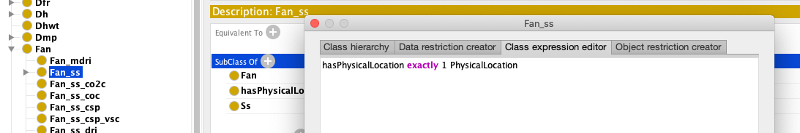

# Ontology RDF Usage Example

This example steps, depicted in the figure below, consists of the following:


1. Extend the Ontology
2. Automatically Generate Code with [OLGA](https://ecostruxure.github.io/OLGA/)
3. Instantiate the Ontology Model with the Generated Code
4. Serialize the Ontology Instance into one of the [W3C standards]() such as 
[Json-Ld](https://json-ld.org/) for example  

## Prerequisites

For this example you will need the following:
1. A _Java Virtual Machine_ (version > 1.8) 
[download JVM 1.8](http://www.oracle.com/technetwork/java/javase/downloads/jre8-downloads-2133155.html).
2. _Protégé_ is an open source ontology editor provided by Stanford University.
 [download Protégé](http://protege.stanford.edu/products.php#desktop-protege).
3. _Apache Maven_ a software project management 
[download Maven](https://maven.apache.org/download.cgi).

## [Step 1]: Extend the Ontology

The Digital Buildings repo proposes two formats: [yaml](https://github.com/google/digitalbuildings/blob/master/ontology/yaml/README.md), and [rdf/owl](https://github.com/google/digitalbuildings/blob/master/ontology/rdf/README.md).
We have two possible options:
* If you are not familiar with the W3C standards, extend the Yaml format. 
  Then, use the [RDF Generator](https://github.com/google/digitalbuildings/blob/master/tools/rdf_generator/README.md) to generate an RDF Format, similar to the one on the [repo](https://github.com/google/digitalbuildings/tree/master/ontology/rdf/README.md).
* If you are familiar with RDF and OWL, you can extend the [RDF version](https://github.com/google/digitalbuildings/tree/master/ontology/rdf) using any W3C compliant ontology editor.
In this example, we rely on [Protege](https://protege.stanford.edu/) to extend it.

### Equipment and a Physical Location

In this example, we will associate a `Physical Location` to the `Fan_ss` equipment.

* In the Protege `Classes` view locate `Fan` then `Fan_ss`
* In the `Description` widget Click on the `+` sign new `SubClass Of`
* A window will pop up, select `Class expression editor`
* Enter the following: `hasPhysicalLocation exactly 1 PhysicalLocation`
* Click `Ok` and `Save`



## [Step 2]: Code Generation with OLGA
In this step 2, we will generate code from the RDF model by relying on 
[OLGA](https://ecostruxure.github.io/OLGA/).

### OLGA
Ontology Library GenerAtor (OLGA) is an open source project which takes as
 input a W3C standard ontology and generates code in one or several languages 
 such as (C#, Java, and Python).
 
 The generated code is dependent on one of the many available libraries such as 
 [RDF4J](https://rdf4j.org/), [OWL API](https://github.com/owlcs/owlapi), 
 [Trinity RDF](https://trinity-rdf.net/), and many others.

This generated code will allow a developer to easily create an instance of a 
building model in RDF without any pre-requisite knowledge of the W3C standards. 
The developer will instantiate classes and link them together to create an 
instance of a building topology with its floors, rooms, HVAC equipment, meters, 
and how they are related to each other.

### Generated Code

In this example, we already generated the code for you using 
[OLGA](https://ecostruxure.github.io/OLGA/).

The generated source code is in the [generatedCode](./generatedCode) folder.
It is in Java and relies on the  [RDF4J](https://rdf4j.org/) existing library.

In case you want to generate the code from OLGA use the following options:
```shell script
-preserve --code java --library rdf4j --name DigitalBuildings --path PATH_TO_ONTOLOGY
```

### Compile the Generated code
 
Run the following command using `Apache Maven` to generate a .jar: 
 ```shell script
cd digitalbuildings-RDF4J-java
mvn clean install
```

Explore the generated code to see all generated components from the ontology.

### The Generated Code Overview

The following Java code snippet shows part of the code generated by OLGA for 
the class `PhysicalLocation` is a subclass of `EntityType` as shown in the figure below.


```java
public class PhysicalLocation extends EntityType implements IPhysicalLocation{

 IRI newInstance;

 public PhysicalLocation(String namespace, String instanceId) {
  super(namespace, instanceId);

  newInstance = GLOBAL.factory.createIRI(namespace, instanceId);
  GLOBAL.model.add(this, RDF.TYPE, GLOBAL.factory
        .createIRI("http://www.google.com/digitalbuildings/0.0.1/f" 
        + "acilities#PhysicalLocation"));
 }

 public IRI iri() {
  return newInstance;
 }

        
 public void setFriendlyName(String param) {
         GLOBAL.model.add(this,  GLOBAL.factory.createIRI("http://www.google.com" 
         + "/digitalbuildings/0.0.1#hasFriendlyName"), 
         GLOBAL.factory.createLiteral(param));
 }
       
 public void setCode(String param) {
         GLOBAL.model.add(this, GLOBAL.factory
          .createIRI("http://www.google.com/digitalbuildings/0.0.1#hasCode"),  
              GLOBAL.factory.createLiteral(param));
}}
```      

The generated code is dependent on the underlying library RDF4J which is an 
open source project.
The following code snippet, shows the generated code in Java for the Building 
`owl:Class` which is a subclass of `PhysicalLocation`.

```java
/**
* Class Building 
* This is a type for BUILDING facilities object
*/
@SuppressWarnings("serial")
public class Building extends PhysicalLocation implements IBuilding{

     IRI newInstance;
     public Building(String namespace, String instanceId) {
                super(namespace, instanceId);

                newInstance = GLOBAL.factory.createIRI(namespace, instanceId);
                GLOBAL.model.add(this, RDF.TYPE, GLOBAL.factory.createIRI(
"http://www.google.com/digitalbuildings/0.0.1/facilities#Building"));
   }

   public IRI iri() {
    return newInstance;
   }

        
   public void setPhysicalAddress(String param) {
     GLOBAL.model.add(this, GLOBAL.factory.createIRI("http://www.google.com/" 
     + "digitalbuildings/0.0.1#hasPhysicalAddress"), 
      GLOBAL.factory.createLiteral(param));
   }
        
  public void addHasFloor(IFloor parameter) {
                GLOBAL.model.add(this, 
                GLOBAL.factory.createIRI("http://www.google.com/" 
                + "digitalbuildings/0.0.1#has"), parameter);
  }
  //...
 }
```

OLGA packages also the generated code according to each language and environment:
Java: a .jar package is created in addition to an Apache maven dependency 
as shown below for the given example previously. 
The version in the generated code is extracted from the ontology version.
```
<dependency>
 <groupId>OLGA-RDF4J</groupId>                      
 <artifactId>digitalbuildings-RDF4J</artifactId>
 <version>0.0.1</version>
</dependency>
```   

In the following step, the generated code will be used to instantiate 
a simple example of a building with floors and an equipment.

## [Step 3] Instantiate the Ontology Model with the Generated Code
The previous steps allowed us to generate one or several libraries that are 
conform with the ontology.
 
In this step, you will instantiate the ontology model for a particular building. 
You will now import the generated library into your favorite IDE in order to 
start writing the business logic to instantiate a building. 

This business logic can then be deployed on a gateway or a _BMS_ as shown in this 
paper [link](https://docs.google.com/viewer?a=v&pid=sites&srcid=ZGVmYXVsdGRvbWFpbnxjaGFyYmVsd2VifGd4OjQwN2FiY2M2MWQ3ZDA2MTY).

### Import the Generated Library

The first step is to import the generated library in your _IDE_